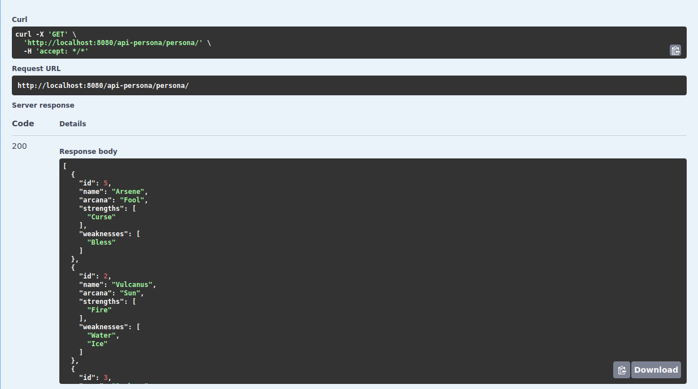

<div align="justify">

# Persona

<div align="center">

</div>

## Índice
- [Proyecto de Persona](/persona-project/)
  - [Detalles del proyecto](#index01)
  - [Modelo de datos utilizado ](#index02)
  - [Funcionalidades implementadas](#index03)
  - [Demostración](#index04)

## Detalles del proyecto <a name="index01" ></a>
> **Desarrolladores:** José Maximiliano B. M. ([@mackstm](https://github.com/mackstm)), Nabil L.A. ([@nalleon](https://github.com/nalleon)) 
<br>

Proyecto de temática libre realizado durante el curso 2023/2024 del CFGS de Desarrollo de Aplicaciones Multiplataforma (DAM) para el módulo de Base de Datos (BAE). Para realizarlo, hemos configurado una cuenta en [MongoDB Atlas](https://www.mongodb.com/) para utilizar un clúster que contenga 3 colecciones con las que implementaremos unas operaciones de CRUD sobre las entidades que perteneces a cada una de las colecciones respectivamente. 

El proyecto ha sido desarrollado con la temática de la saga de videojuegos ***Persona*** perteneciente a ATLUS. 

Las tecnologías que hemos utilizado han sido la siguientes:

- [IntelliJ IDEA - Community Edition](https://www.jetbrains.com/es-es/idea/) para el código en Java.
- [Visual Studio Code](https://code.visualstudio.com/) para la realización de documentos en markdown.
- [GitHub](https://github.com/) para la gestión principal del proyecto.

## Modelo de datos utilizado <a name="index02" ></a>

El relacion a la tematica, decidimos crear nuestras 3 colecciones como Compedium, PersonaUser y Equipment.

**1.** Compedium

```code
    private int id;
    private String name;
    private String arcana;
    private Set<String> strengths;
    private Set<String> weaknesses;
```

> **NOTA:** El compedio está compuesto por los Persona, por lo tanto la clase se llama Persona.
<br>

**2.** PersonaUser
```code
    private int id;
    private String name;
    private String lastName;
    private String game;
    private String arcana;
    private boolean wildCard;
```

**3.** Equipment
```code
    private int id;
    private String weaponName;
    private String weaponType;
    private int shopPrice;
```

## Funcionalidades implementadas <a name="index03"></a>
La aplicación incluye las funcionalidades de un CRUD respectivamente para cada una de las entidades del CRUD:

- **Crear:**
  - Persona: Agregar un nuevo persona al compedio. 
  - PersonaUser: Agregar un personaje.
  - Equipment: Agregar un equipamiento.


- **Leer:**
  - Persona: Leer uno o todos los persona al compedio. 
  - PersonaUser: Leer uno o todos los personajes.
  - Equipment: Leer uno o todos los equipamientos.


- **Actualizar:**
  - Persona: Actualizar un persona del compedio. 
  - PersonaUser: Actualizar un personaje.
  - Equipment: Actualizar un equipamiento.

- **Eliminar:**
  - Persona: Eliminar un persona del compedio. 
  - PersonaUser: Eliminar un personaje.
  - Equipment: Eliminar un equipamiento.

<br>


## Ejecución/Ejemplos <a name="index04"></a>

Hemos utilizado swagger para mostrar como funcionan las operaciones.

``````
http://localhost:8080/api-persona/swagger-ui/index.html#/
``````
- GET
- POST
- PUT
- DELETE

### GET
1. Persona

<div align="center">

</div>

2. PersonaUser

<div align="center">

</div>

3. Equipment

<div align="center">

</div>


### POST
1. Persona

<div align="center">

</div>

2. PersonaUser

<div align="center">

</div>

3. Equipment

<div align="center">

</div>


### PUT
1. Persona

<div align="center">

</div>

2. PersonaUser

<div align="center">

</div>

3. Equipment

<div align="center">

</div>


### DELETE
1. Persona

<div align="center">

</div>

2. PersonaUser

<div align="center">

</div>

3. Equipment

<div align="center">

</div>


</div>

